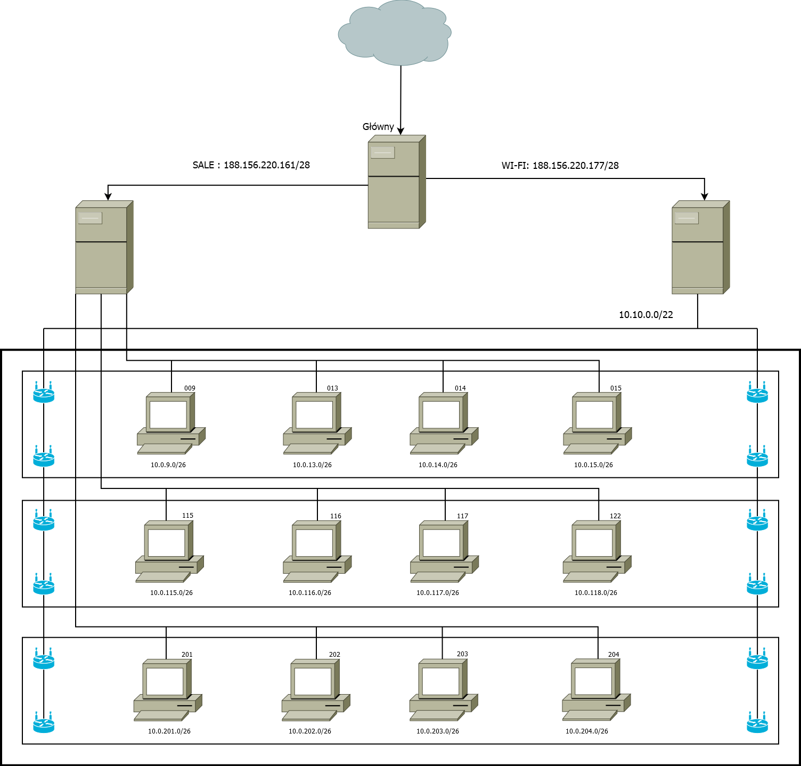

# Zadanie 2

## Projekt sieci lokalnej dla jednostki dydaktycznej uniwersytetu


### Cel Projektu
  Zaprojektowanie i weryfikacja działania sieci w środowisku testowym. 
  Rozwiązanie zapewnia dostęp do internetu dla wszystkich urządzeńw infrastrukturze.
  
### Założenia projektu

* Sieć zlokalizowana jest w budynku 3 kondygnacyjnym
* Na kążdej z kondygnacji znajdują się laboratoria komputerowe kolejno:
  * poziom 0 
    * 009, 013, 014
  * poziom 1
    * 115, 116, 117, 122
  * poziom 2
    * 201, 202, 203 
* Każde z laboratoriów wyposażone jest w 35 stanowisk dla uczestników kursów
* Jednostka planuje otworzenie kolejnych laboratoriów 017 oraz 204
* Każda kondygnacja wyposażona jest w izolowaną sieć Wi-Fi, udostępniajacą sieć internet podłączonym gościom
  * Sieć Wi-Fi nie pozwala na bezposrednią komunikację z urządzeniami zlokalizowanymi w pozostałej części sieci,
    tj: laboratoria, serwery jednostki
  * Prognozowana maksymalna liczba jednoczesnych urządzeń podłączonych do sieci to ``800``
* Jednostka posiada przyłącze internetowe oraz dysponuje pulą adresów ``188.156.220.160/27``
* Jednostka posiada serwery udostępniajace zasoby do celów dydaktycznych i promocyjnych
  * serwery zlokalizowane są w osobnym pomieszczeniu
  * udostępniają zasoby w sieci publicznej z wykorzystaniem sieci ``188.156.220.160/27``
  * Jeden serwer pełni rolę bramy dla urządzań w sieci lokalnej ``LAN``

### Wstępne założenia

* Każde laboratorium posiada oddzielną podsieć pozwalającą efektywnie zidentyfikować urządzania
  * kondygnacja oraz sala
* Dla uniknięcia zbyt słabego zasięgu sieć WiFi zostanie wyposażona w 4 urządzenia nadawcze na każdej kondygnacji
 

#### zadanie - wymaganai

* Dokonaj podziału i projektu sieci w formie dokumentu w formacie ``MARKDOW`` zawierającego specyfikację tekstową oraz obrazkową
  projektowanej sieci
* Przygotuj prototyp rozwiązania z wykorzystaniem oprogramowania ``VirtualBox`` lub podobnego.
* W specyfikacji uwzględnij wielkości sieci oraz ich adresy
* W specyfikacji uwzględnij konfigurację tablicy routingu
* Dokumentację graficzną stworzonej architektury przygotuj w programie ``DIA`` lub podobnym


ROZWIAZANIE
--- 

#### Podzielenie sieci 188.156.220.160/27 na 2 podsieci:

* ``188.156.220.160/28``
  * podsieć - ``10.0.0.0/22``

* Wi-Fi ``188.156.220.176/28``
  * podsieć - ``10.10.0.0/22``
  
  
#### Przydział adresów do sal:
------
### Poziom 0
  * sala 009:
    *  ``10.0.9.0/26``
  * sala 013:
    *  ``10.0.13.0/26``
  * sala 014:
    *  ``10.0.14.0/26``
  * sala 017:
    *  ``10.0.17.0/26``
  Po 35 komputerów w każdej sali co daje nam 140 komputerów na pięrze 0.
    
### Poziom 1
  * sala 115:
    * ``10.0.115.0/26``
  * sala 116:
    * ``10.0.116.0/26``
  * sala 117:
    * ``10.0.117.0/26``
  * sala 122:
    * ``10.0.122.0/26``
  Po 35 komputerów w każdej sali co daje nam 140 komputerów na pięrze 1.    
    
### Poziom 2
  * sala 201:
    * ``10.0.201.0/26``
  * sala 202:
    * ``10.0.202.0/26``
  * sala 203:
    * ``10.0.203.0/26``
  * sala 204:
    * ``10.0.204.0/26``
  Po 35 komputerów w każdej sali co daje nam 140 komputerów na pięrze 2.
  
  Czyli łącznie 3 x 140 komputerów  = 420 komputerów
  
  
  ### Diagram:
  ---
  
  
  
  
### IP Forwarding
---
``echo 1 >/proc/sys/net/ipv4/ip_forward``

### Routing
---
``ip route add default via 10.0.9.1``  
``ip route add default via 10.0.115.1``  
``ip route add default via 10.0.201.1``  


### Masquerade
---
#### Serwer główny
``sudo iptables -t nat -A POSTROUTING -s 188.156.220.160/28 -o enp0s3 -j MASQUERADE``  
``sudo iptables -t nat -A POSTROUTING -s 188.156.220.176/28 -o enp0s3 -j MASQUERADE``  
``sudo iptables-save | sudo tee /etc/iptables.sav``  

### DHCP
---
``Instalacja DHCP: apt install isc-dhcp-server``  
``Odkomentowujemy: config DHCPDv4_CONF``    

### SALE
---
```
subnet 10.0.9.0 netmask 255.255.252.192 {
        option routers                  10.0.9.1;
        option subnet-mask              255.255.252.192;
        option domain-name-servers      10.0.9.1;
        range                           10.0.9.2 10.0.9.62;
}

subnet 10.0.115.0 netmask 255.255.252.192 {
        option routers                  10.0.115.1;
        option subnet-mask              255.255.252.192;
        option domain-name-servers      10.0.115.1;
        range                           10.0.115.2 10.0.115.62;
}

subnet 10.0.201.0 netmask 255.255.252.192 {
        option routers                  10.0.201.1;
        option subnet-mask              255.255.252.192;
        option domain-name-servers      10.0.201.1;
        range                           10.0.201.2 10.0.201.62;
}

```

### Wi-Fi
---
```
subnet 10.10.0.0 netmask 255.255.252.0 {
        option routers                  11.0.0.1;
        option subnet-mask              255.255.252.0;
        option domain-name-servers      11.0.0.1;
        range                           11.0.0.15 11.0.3.250;
}
```
